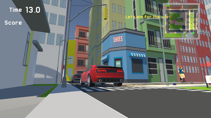

ESCAPECITY

## ゲームプレイができるサイト
- **UnityRoom:** [リンクはこちら](https://unityroom.com/games/escape_city)
- - **itch.io:** [リンクはこちら](https://yotya.itch.io/escapecity)
 

-Assetファイルの中の、Scriptファイルにコードが入っています。

## 概要
昔に戻りたい！子どもの頃は～などと友人と話していた時に思いついたゲームです！
子どもの視点に戻って、脱出するゲームです。
---

## ゲームの説明
- **目的:**  
  街に落ちている大人に戻る薬を取り、脱出口を目指すゲームです。  

- **ルール:**  
  - 町に落ちている薬をなるべく多くとり、ゴールを目指してください！
  - 取得した薬の数、脱出した時間でランクが分けられます！
  - 車や人に当たらないように気を付けてください！

---

## 工夫した点
- **ゲームデザイン:**  
  - 子どもの視点になるように、ほかのオブジェクトより小さく、視点を低くしました。
  - 路地裏など子どもの時に気になっていた場所などを作りました。
  - 没入感を出すために、1人称カメラにしました。
